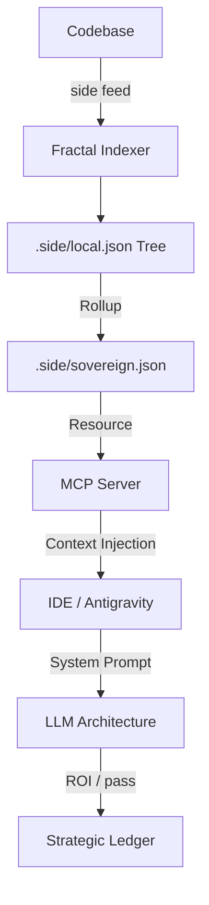

# 🦅 Sidelith: The Sovereign Context Engine

> **"Make Cursor Smarter. Fix Claude's Amnesia. Own Your Intelligence."**

Sidelith is the **Sovereign Middleware** that sits between You and your AI tools (Cursor, VS Code, CLI). It doesn't replace them; it **feeds** them.

We act as your **Local Chief of Staff**, managing:
1.  **Context**: We proactively load the *right* files and strategy before you even ask.
2.  **Memory**: We remember your architectural decisions so you don't have to repeat them.
3.  **Security**: We sanitize your code *before* it hits the cloud.

---

## 🤝 The Best Friend Strategy (Symbiosis)

We are not competing with Cursor or Claude. We are their **Intel Source**.

1.  **The Context Booster**: Open a chat, and Sidelith injects your *derived* project strategy into the prompt. No more "I forgot what library we use."
2.  **The Safety Net**: Before you paste that code, Sidelith's **Pulse Engine** checks it for secrets and architectural violations.
3.  **The Constant Brain**: When APIs fail (Groq/OpenAI), Sidelith manages the failover so you never stop coding.

---

## 🛡️ The Sovereign Moats (Why We Win)

We don't compete on "Editor Features." We compete on **The Brain**.

1.  **🏰 The Governance Moat (Constitutional Monarchy)**
    *   **The Problem**: Linters act as "Nagging Parents."
    *   **Our Solution**: **Atomic Sovereignty**. Rules are individual JSON files (`.side/rules/`) that you can *negotiate* with the AI via MCP.
    *   **Result**: You are not a typist; you are the **Monarch**.

2.  **🧠 The Memory Moat (Sovereign Ledger)**
    *   **The Problem**: Cloud LLMs have "Amnesia." They forget your strategic intent after the chat closes.
    *   **Our Solution**: **Permanent Context**. We store your "Correction Vectors" (Rejections) and "Mandates" in a local SQLite Brain (`.side/local.db`).
    *   **Result**: Sidelith never makes the same mistake twice.

3.  **🔒 The Privacy Moat (Neural Shield)**
    *   **The Problem**: To be smart, AI needs your secrets. To be safe, it shouldn't have them.
    *   **Our Solution**: **Encrypted At Rest**. Your context is sealed with AES-256 locally. Even if you sync to the cloud, they only see cipher-text.
    *   **Result**: Enterprise-grade intelligence with Air-gapped security.

4.  **⚡ The Architecture Moat (Fractal Index)**
    *   **The Problem**: Monoliths (VS Code) are slow to index massive repos.
    *   **Our Solution**: **Fractal Merkle Trees**. Indexing is O(log n).
    *   **Result**: Infinite Scalability. 10 users or 10,000—the speed is the same.

---

## 🧠 Core Intelligence

### 1. The Context Engine (Auto-Discovery)
Sidelith is **Stateful**. It uses **Active Listening** to build the "Mental Model" (`sovereign.json`) of your company in real-time.
*   **Mechanism**: We monitor every file change to *derive* the Strategy. We don't just read manual docs.
*   **Result**: It feeds the LLM the **exact deltas** and context it needs using `AutoIntelligence`.

### 2. The Semantic Spear (Forensics)
We don't just lint syntax (Ruff does that). We lint **Intent**.
*   **Arrow Pattern Detection**: Catches deeply nested logic that harms readability.
*   **Architectural Drift**: Warns you if a new file violates the `MONOLITH.md` structure.

### 3. Neural Resilience
*   **Circuit Breaker**: If Groq (Fast) fails, we auto-switch to OpenAI (Smart) -> Anthropic (Deep).
*   **The Brain Never Dies**: Graceful degradation ensures you never lose the ability to code, even if APIs go down.

---

## 🔄 The Unified Context Plane (Architecture)

**"One Brain. Multiple Interfaces."**

Just like Supabase (CLI + Dashboard), Sidelith offers **Interface Parity**.
*   **The CLI (`side`)**: Use this for high-bandwidth tasks (Feed, Audit, Login).
*   **The MCP (IDE)**: Use this for conversational tasks (Chat, Strategy).

**They share the same Brain.**
Both interfaces write to the same `sovereign.json`. You can run a heavy audit in the terminal, and then ask Cursor about the results instantly. You are never locked in.

---

## 📊 The Context Journey (100-Day ROI)

Sidelith doesn't just 'help' your LLM; it provides the **Hard Drive** for its **Brain**.

| Stage | Scenario | Cursor Default (3% Context) | side + Cursor (100% Context) |
| :--- | :--- | :--- | :--- |
| **Day 1** | Fresh Onboarding | Hallucinates stack/docs. (2hr fix) | **Detects Code DNA instantly. (90% ROI)** |
| **Day 7** | Feature Build | Loses strategic intent. Drift occurs. | **Strategic DNA injected. Zero Drift.** |
| **Day 100** | Maintenance (500k loc) | Amnesia. "Indexing... 0%" | **Fractal lookup (<5ms). Perfect recall.** |

---

## 🗺️ Data Architecture (The Shadow Tree)

Sidelith uses a **Sovereign Protocol v3 (Fractal Context)** to ensure infinite scalability.

*   **📍 Local Context**: `[folder]/.side/local.json` (Deep DNA of specific logic).
*   **📍 Master Index**: `.side/sovereign.json` (The Merkle Rollup).
*   **📍 Historic Wisdom**: `.side/memory.json` (User decisions & strategic sessions).

**The Flow**:
1.  **Index**: `side feed` building a distributed Merkle Tree of code understanding.
2.  **Serve**: The MCP Server reads only the relevant "Fractal" files for your current focus.
3.  **Consume**: Antigravity injects high-fidelity DNA into your IDE prompts.



---

---

## 💎 The Sovereign Economy (Pricing)

We charge based on **Sovereign Units (SUs)**—a measure of Codebase Size + Intelligence consumed.
*   *Small Repo Indexing*: ~10 SUs/mo.
*   *Deep Audit*: ~50 SUs.

1.  **Trial**: **500 SUs** (Lifetime Grant). Enough to audit a small project.
2.  **Pro**: **5,000 SUs/mo**. Standard for Freelancers ($20/mo).
3.  **Elite**: **25,000 SUs/mo**. For 10x Engineers & Large Repos ($60/mo).
4.  **High Tech**: **10,000 SUs** + **Sovereign Airgap** (Ollama) ($100/mo).
5.  **Enterprise**: High Volume + Governance + Airgap Options ($Custom).

**🔋 Add-ons (Top Up)**
Running low on Sovereignty? You can top up your wallet anytime.
*   **Minimum Top Up**: **$10** (adds 2,500 SUs).
*   *Financial Grade Reporting*: Run `side report` to see your burn rate and asset allocation.

---

## ⚡ Quick Start

### 1. Install & Activate
```bash
# 1. Install Sidelith (Global)
pip install sidelith  # (Simulated - use 'pip install -e .' for now)

# 2. Activate your Tier (Trial/Pro/Elite)
side login --key side_pro_xxxxx
```

### 2. Ignite (Build Memory)
```bash
# Analyze your repo to build the Sovereign Context
side feed .
```

### 3. Connect to IDE (MCP)
```bash
# Generate MCP configuration for Cursor / Claude Desktop
side connect
```

---

## 📂 The Engineering of Sovereignty (Project Structure)

Here is where our Moats live in the codebase:

*   **The Shield**: `backend/src/side/pulse.py`
    *   *Role*: The local regex/rule engine. Blocks secrets, not creativity.
*   **The Governor**: `backend/src/side/server.py`
    *   *Role*: The Resource Monitor. Keeps Sidelith invisible (<1% CPU).
*   **The Brain**: `backend/src/side/intel/auto_intelligence.py`
    *   *Role*: The Active Context Engine. Continually listens to code changes to generate and update the `sovereign.json` Knowledge Graph.
*   **The Spear**: `backend/src/side/tools/forensics_tool.py`
    *   *Role*: The Semantic Auditor. Finds deep logic errors.

---

## 🔮 Next: Contextual Feeding Mechanisms
*(Currently in Alpha - V2.1)*

We are building the **"Feed" Protocol** (`side feed .`).
*   **Goal**: To analyze your entire Git history and generate a `sovereign.json` that captures your "Company Soul".
*   **Use Case**: You hire a new dev. They run `side feed`. Suddenly, their local LLM knows 5 years of context.
*   **Status**: Core logic exists in `AutoIntelligence`. CLI wrapper coming next.

> **Status**: V2 (Consumer + Enterprise Ready).
> **License**: Sovereign.
