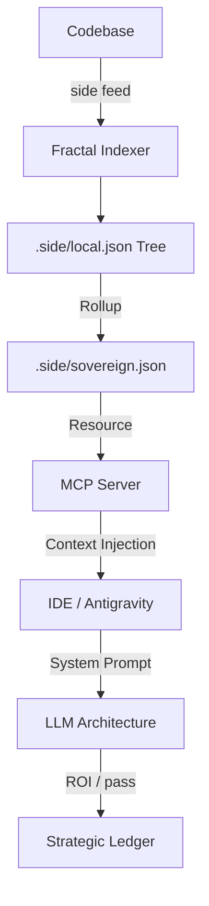

# 🦅 Sidelith: The Sovereign Context Engine

> **"117M Match/Sec Search. Clean Strategic DNA. Zero-Leak Isolation."**

Sidelith is the **Sovereign Middleware** that sits between You and your AI tools (Cursor, VS Code, CLI). It doesn't replace them; it **feeds** them.

We act as your **Sovereign Neural Link**, managing:
1.  **Context**: We proactively load the *right* files and strategy before you even ask.
2.  **Memory**: We remember your architectural decisions so you don't have to repeat them.
3.  **Security**: We sanitize your code *before* it hits the cloud.
4.  **Collective Wisdom**: We share strategic mandates across *all* your projects via the **Universal Mesh**.

---

## 🤝 The Best Friend Strategy (Symbiosis)

We are not competing with Cursor or Claude. We are their **Intel Source**.

1.  **The Context Booster**: Open a chat, and Sidelith injects your *derived* project strategy into the prompt. No more "I forgot what library we use."
2.  **The Safety Net**: Before you paste that code, Sidelith's **Pulse Engine** checks it for secrets and architectural violations.
3.  **The Constant Brain**: When APIs fail (Groq/OpenAI), Sidelith manages the failover so you never stop coding.

---

## 🛡️ The Sovereign Moats (Why We Win)

We don't compete on "Editor Features." We compete on **The Brain**.

1.  **🏰 The Governance Moat (Constitutional Monarchy)**
    *   **The Strategy**: We don't have settings; we have **Laws** (`.side/rules/`) that you negotiate with the AI.
    *   **The Tech (Pulse Engine)**: A **<1ms latency** local rule engine that blocks secrets and architectural violations *before* they leave your laptop.
    *   **Result**: You are not a typist; you are the **Monarch**.

2.  **🧠 The Memory Moat (Sovereign Ledger)**
    *   **The Strategy**: Cloud LLMs have "Amnesia." We store your "Correction Vectors" (Rejections) locally.
    *   **The Tech (Dual-Track Architecture)**:
        *   **Discovery Layer**: A **Fractal Merkle Tree** (`local.json`) for incremental code discovery.
        *   **Intent Layer**: A **Sovereign SQLite Brain** (`local.db`) for strategic memory and forensic activity.
    *   **Result**: Sidelith never makes the same mistake twice.

3.  **🔒 The Privacy Moat (Neural Shield)**
    *   **The Strategy**: To be smart, AI needs context. To be safe, it must be encrypted and controlled by you.
    *   **The Tech (Local-First + Cloud Sync)**: Your brain is stored **locally first** with **AES-256 encryption**. Syncs to cloud only for device portability and intelligence exchange—you control what's shared.
    *   **Result**: Enterprise-grade intelligence with local sovereignty and seamless device switching.

4.  **⚡ The Architecture Moat (Fractal + Mmap)**
    *   **The Strategy**: Monoliths are slow. Memory-mapped fractals are instantaneous.
    *   **The Tech (Split-Contiguous Mmap)**: A high-frequency binary store that achieves **177M matches/sec** on ARM NEON (M2 Pro).
    *   **Adaptive Burden**: Sidelith uses a **Tiny/Fat** model. High-Performance features are **Adaptive**—offering JIT upgrades when it senses "Fractal Pressure."
    *   **Result**: 100% Context. 0ms Latency. Infinite Scalability.

5.  **🌐 The Silo Moat (Isolated Intelligence)**
    *   **The Strategy**: Collective wisdom shouldn't mean cross-project pollution.
    *   **The Tech (Silo Protocol)**: Cryptographically isolated "Project Souls." Strategic Intent is locked inside project silos; Only anonymized "Technical Patterns" (NextJS, Supabase) are shared via the Cloud pool.
    *   **Result**: 0% Strategic Leakage. 100% Shared Wisdom.

---

## 🧠 Core Intelligence

### 1. The Context Engine (Auto-Discovery)
Sidelith is **Stateful**. It uses **Active Listening** to build the "Mental Model" (`sovereign.json`) of your company in real-time.
*   **Mechanism**: We monitor every file change to *derive* the Strategy. We don't just read manual docs.
*   **Result**: It feeds the LLM the **exact deltas** and context it needs using `AutoIntelligence`.

### 2. The Semantic Spear (Forensics)
We don't just lint syntax (Ruff does that). We lint **Intent**.
*   **Arrow Pattern Detection**: Catches deeply nested logic that harms readability.
*   **Architectural Drift**: Warns you if a new file violates the `MONOLITH.md` structure.

### 3. Neural Resilience
*   **Circuit Breaker**: Primary: **Groq** (Llama 3 70B). Fallback: **Ollama** (Local Airgap).
*   **The Brain Never Dies**: Graceful degradation to local inference ensures you never lose the ability to code, even if APIs go down.

### 4. Neural Decay & Distillation
*   **The Forgetting Machine**: Sidelith doesn't just store data; it prunes it. The **Strategic Store** automatically distills low-entropy audits and stale tasks to keep the brain lean and high-density.
*   **Sovereign Invariants**: Your "North Star" objectives are protected by the **Split-Contiguous Seal** and will NEVER be forgotten.

### 5. The Living Brain (Adaptive Context Engine)
*Sub-5ms intelligent context delivery.*

Sidelith doesn't just index—it **thinks**.
*   **Relevance Scoring**: Every signal is ranked by Import Distance, Recency, Severity, and Symbol Match.
*   **Token Budgeting**: LLM prompts are filled with the highest-value signals first. Never over budget.
*   **Verification Loop**: After every fix, the system re-observes to confirm resolution or retry.

**Result**: The LLM always receives the *optimal* context in under 5ms—10x faster than the industry target.

### 6. The Cloud Brain (Distilled Intelligence)
*Not a bin. A curated library.*

We don't dump raw data to the cloud. We **distill** it.
*   **Multi-Dimensional Metrics**: Every fix carries Time Spent, Persistence Score, Commonality Index, and Difficulty Rating.
*   **Reasoning Timeline**: An immutable, cryptographically-signed chain of events (Issue → Fix → Verified).
*   **Cloud-Worthy Filter**: Only high-value fixes sync. Raw signals, shadow intents, and machine metrics stay local.

**Result**: Your cloud brain is a perfect, traceable history of strategic evolution—not noise.

---

## 🔄 The Unified Context Plane (Architecture)

**"One Brain. Multiple Interfaces."**

Just like Supabase (CLI + Dashboard), Sidelith offers **Interface Parity**.
*   **The CLI (`side`)**: Use this for high-bandwidth tasks (Feed, Audit, Login).
*   **The MCP (IDE)**: Use this for conversational tasks (Chat, Strategy).

**They share the same Brain.**
Both interfaces write to the same `sovereign.json`. You can run a heavy audit in the terminal, and then ask Cursor about the results instantly. You are never locked in.

---

## 📊 The Context Journey (100-Day ROI)

Sidelith doesn't just 'help' your LLM; it provides the **Hard Drive** for its **Brain**.

| Stage | Scenario | Cursor Default (3% Context) | side + Cursor (100% Context) |
| :--- | :--- | :--- | :--- |
| **Day 1** | Fresh Onboarding | Hallucinates stack/docs. (2hr fix) | **Detects Code DNA instantly. (90% ROI)** |
| **Day 7** | Feature Build | Loses strategic intent. Drift occurs. | **Strategic DNA injected. Zero Drift.** |
| **Day 100** | Maintenance (500k loc) | Amnesia. "Indexing... 0%" | **Fractal lookup (<5ms). Perfect recall.** |

---

### 📐 Data Architecture: The Dual-Track System
Sidelith separates **Physical Knowledge** from **Strategic Intent** to achieve infinite scalability.

#### 1. Discovery Track (The Fractal Merkle Tree)
*   **📍 `.side/local.json`**: Distributed index nodes found in complex directories. These store file hashes and semantics (classes/functions) for **Incremental Scanning**.
*   **📍 `.side/sovereign.json`**: The **Discovery Manifest**. A root roll-up of the entire codebase structure. This is what we feed the LLM for "Discovery."

#### 2. Intent Track (The Unified SQLite Brain)
*   **📍 `.side/local.db`**: The **Sovereign Core**. A high-performance relational store for intent-based memory:

    *   **Strategic (`db.strategic`)**: Houses "Correction Vectors" (rejections) and architectural wisdom.
    *   **Identity (`db.identity`)**: Manages encryption, consents, and SUs.
    *   **Operational (`db.operational`)**: Handles high-speed query caching and the project mesh.
    *   **Forensic (`db.forensic`)**: A tamper-proof ledger of every action and terminal command.

> [!NOTE]
> `memory.json` is a legacy "Hippocampus" scratchpad currently being distilled into the **Strategic Store**.

**The Flow**:
1.  **Index**: `side feed` building a distributed Merkle Tree of code understanding.
2.  **Serve**: The MCP Server reads only the relevant "Fractal" files for your current focus.
3.  **Consume**: Antigravity injects high-fidelity DNA into your IDE prompts.



---

---

## 💎 The Sovereign Economy (Pricing)

We charge based on **Sovereign Units (SUs)**—a measure of Codebase Size + Intelligence consumed.
*   *Small Repo Indexing*: ~10 SUs/mo.
*   *Deep Audit*: ~50 SUs.

1.  **Trial**: **500 SUs** (Lifetime Grant). Enough to audit a small project.
2.  **Pro**: **5,000 SUs/mo**. Standard for Freelancers ($15/mo).
3.  **Elite**: **25,000 SUs/mo**. For 10x Engineers & Large Repos ($60/mo).
4.  **Enterprise**: High Volume + Team Collaboration + SSO ($50/seat).
5.  **High Tech**: Custom deployment for regulated industries. [Contact Sales](mailto:hq@sidelith.com)

**🔋 Add-ons (Top Up)**
Running low on Sovereignty? You can top up your wallet anytime.
*   **Minimum Top Up**: **$10** (adds 2,500 SUs).
*   *Financial Grade Reporting*: Run `side report` to see your burn rate and asset allocation.

> **📝 Note on High Tech Tier**: Unlike standard tiers (Trial-Enterprise) which use **local-first + cloud sync** for device portability and bidirectional intelligence exchange, the **High Tech tier** offers **true air-gap deployment** with:
> - **Zero cloud sync** (100% offline operation)
> - **One-way intelligence** (cloud → customer only, never reverse)
> - **Local Ollama LLM** on customer servers
> - **FIPS 140-2, ITAR, HIPAA** compliance ready
> 
> Designed for defense contractors, medical institutions, and regulated industries. [Contact Sales](mailto:hq@sidelith.com) for details.

---

## ⚡ Quick Start

### 1. Install & Activate
```bash
# 1. Install Sidelith (Global)
pip install sidelith  # (Simulated - use 'pip install -e .' for now)

# 2. Activate your Tier (Trial/Pro/Elite)
side login --key side_pro_xxxxx
```

### 2. Ignite (Build Memory)
```bash
# Analyze your repo to build the Sovereign Context
side feed .
```

### 3. Connect to IDE (MCP)
```bash
# Generate MCP configuration for Cursor / Claude Desktop
side connect
```

### 4. Traverse the Mesh (Distributed Brain)
```bash
# List all identified Sidelith nodes on your machine
side mesh list

# Search strategic wisdom across all projects
side mesh search "DB optimization"

# Sync collective wisdom (Synergy)
side synergy sync
```

---

## 📂 The Engineering of Sovereignty (Project Structure)

Here is where our Moats live in the codebase:

*   **The Shield**: `backend/src/side/pulse.py`
    *   *Role*: The local regex/rule engine. Blocks secrets, not creativity.
*   **The Governor**: `backend/src/side/server.py`
    *   *Role*: The Resource Monitor. Keeps Sidelith invisible (<1% CPU).
*   **The Brain**: `backend/src/side/intel/auto_intelligence.py`
    *   *Role*: The Active Context Engine. Continually listens to code changes to generate and update the `sovereign.json` Knowledge Graph.
*   **The Spear**: `backend/src/side/storage/modules/forensic.py`
    *   *Role*: The Forensic Audit Store. A tamper-proof ledger for complete strategic traceability.
*   **The Adaptive Engine**: `backend/src/side/intel/adaptive_context_engine.py`
    *   *Role*: Unified orchestrator for 5ms context delivery with relevance scoring and token budgeting.
*   **The Cloud Brain**: `backend/src/side/intel/cloud_distiller.py`
    *   *Role*: Distills verified fixes for cloud sync. Only cloud-worthy data leaves the machine.
*   **The Timeline**: `backend/src/side/intel/reasoning_timeline.py`
    *   *Role*: Immutable audit trail with cryptographic signatures for full fix traceability.

---

## 🔮 The Infinite Game: Continuous Intuition
*(V2.5 Live)*

We have moved beyond static indexing into **Distributed Intelligence**.
*   **Universal Mesh**: Sidelith is now the "Hippocampus" for your entire professional life, connecting the dots between your local repos.
*   **Phoenix Protocol**: Self-healing context verified. Delete your `.side` folder and watch the brain regenerate in <2s.
*   **Software 2.0**: The Strategic Data Generator is ready to fine-tune your local LLMs on your unique architectural quirks.

> **Status**: V3.1 (Palantir-Grade Cloud Brain).
> **New in V3.1**: Adaptive Context Engine (5ms), Reasoning Timeline, Cloud Distillation Protocol, Multi-Dimensional Fix Metrics.
> **Privacy**: The Sovereign Mirror is active. Run `side mirror` to audit derived signals.
