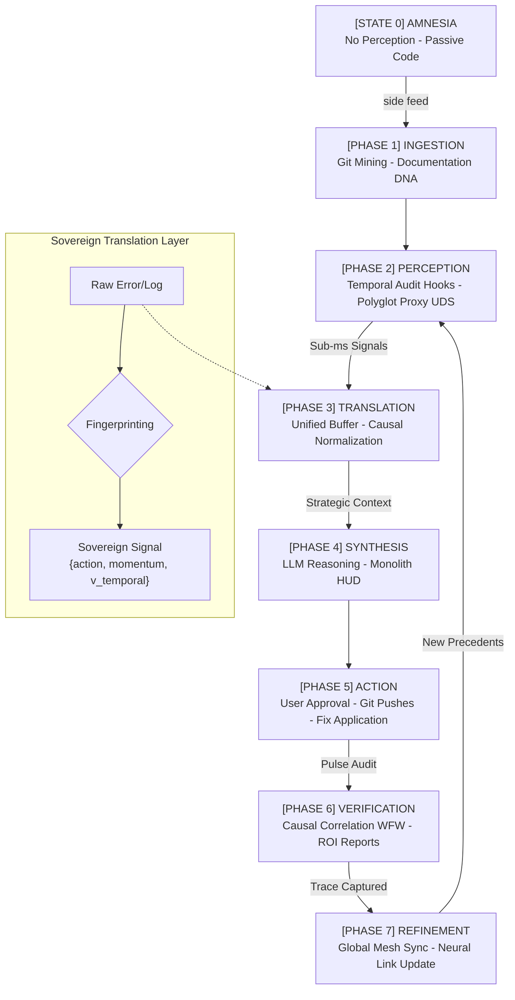

# The Sovereign Strategic Cycle: From Amnesia to Global Mesh

This document visualizes the Sovereign Cycle — the closed-loop system Sidelith uses to ingest, synthesize, and verify strategic knowledge across polyglot ecosystems.

---

## 🛰️ 1. The Full Cycle Diagram



---

## 🧬 2. Knowledge Translation: The Sovereign Schema

Sidelith doesn't just "read logs"; it **transmutes** them into strategic signals. Every event is filtered through the **Tbilisi Consensus** to minimize noise:

1.  **Capture**: 
    *   **Python**: Hooks into `sys.addaudithook` and `logging`.
    *   **Polyglot**: Ingests JSON payloads via `polyglot.sock` (UDS) from Swift, Go, or Rust proxies.
2.  **Normalization**: The event is converted into a **Sovereign Signal**:
    ```json
    {
      "project_id": "9a8f2...",
      "tool": "polyglot_proxy",
      "action": "unhandled_exception",
      "payload": {
        "momentum": 1.0,        // Strategic Weight (High)
        "v_temporal": 0.85,     // Decay rate
        "biology": "swift/uikit", // Ecosystem Fingerprint
        "details": "..."
      }
    }
    ```
3.  **Deduplication**: The `UnifiedBuffer` ensures that a "log storm" doesn't overwhelm the system by collapsing similar signals.

---

## 🛠️ 3. The Causal Loop (WFW Algorithm)

The **What Fixed What (WFW)** algorithm is the cornerstone of Sidelith's intelligence:
*   **Gap Detect**: Sidelith sees a high-friction pulse (e.g., a crash).
*   **Edit Trace**: Sidelith tracks the file modifications made immediately after.
*   **Verification**: If the pulse score drops (Success), Sidelith correlates the code change to the fix.
*   **Immutability**: This success pattern is "Sealed" and shared with your other nodes via the **Universal Mesh**, effectively curing **Distributed Amnesia**.
