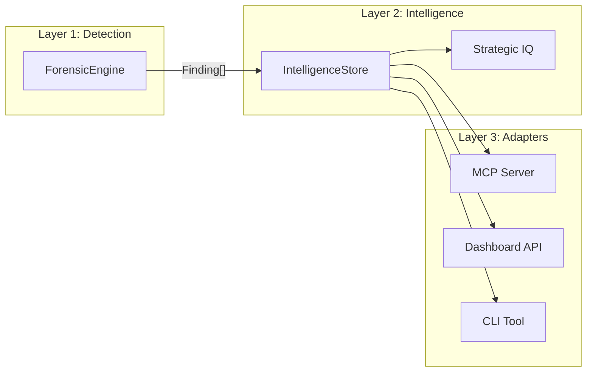
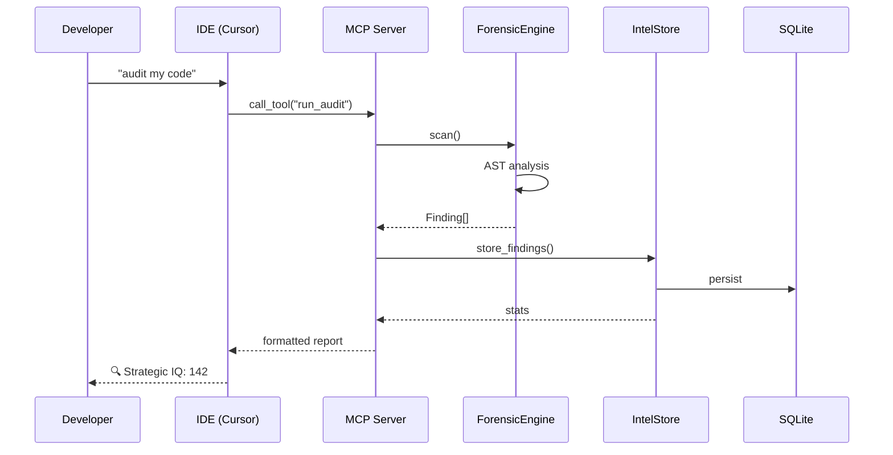

# Side Architecture

> **"Grammarly for Strategy"** - A silent, always-on Strategic Language Server for modern IDEs.

## System Overview

```mermaid
graph TB
    subgraph IDE["🖥️ IDE (Cursor/Windsurf)"]
        User[Developer]
        Chat[AI Chat]
    end
    
    subgraph MCP["📡 MCP Server"]
        Router[Tool Router]
        Tools[6 Strategic Tools]
    end
    
    subgraph Intel["🧠 Intelligence Layer"]
        FE[ForensicEngine]
        IS[IntelligenceStore]
        Strategist[Strategist LLM]
    end
    
    subgraph Storage["💾 Local Storage"]
        DB[(SQLite)]
    end
    
    subgraph Dashboard["🌐 Web Dashboard"]
        API[/api/forensics]
        UI[Dashboard UI]
    end
    
    User -->|"ask strategic questions"| Chat
    Chat -->|"MCP protocol"| Router
    Router --> Tools
    Tools --> FE
    Tools --> Strategist
    FE --> IS
    IS --> DB
    
    API -->|"fetch findings"| IS
    UI -->|"display"| API
```

## DRY Architecture: Single Source of Truth



**Key Principle**: All intelligence flows through `IntelligenceStore`. No adapter does its own analysis.

## Core Components

### ForensicEngine (`intel/forensic_engine.py`)
- **Purpose**: AST-based code analysis for architectural violations & deployment risks
- **Detections**: Stale docs, complexity, security holes, over-engineering, **Deployment Gotchas**
- **Output**: Structured `Finding` objects

### IntelligenceStore (`intel/intelligence_store.py`)
- **Purpose**: Persistence and aggregation of findings
- **Features**: Strategic IQ calculation, finding resolution, stats
- **Storage**: Local SQLite database

### MCP Server (`mcp_server.py`)
- **Purpose**: Expose intelligence as IDE tools
- **Tools**: 6 strategic tools (decide, strategy, plan, check, simulate, audit)
- **Protocol**: Model Context Protocol (stdio)

### Tools Package (`tools/`)
- **Modular structure**: core, definitions, router, strategy, planning, simulation, audit
- **DRY**: Shared utilities in `core.py`, formatting in `formatting.py`

## Data Flow



## Security Model

- **Local-First**: All data stored in local SQLite (`.side/local.db`)
- **No Cloud Leaks**: Sensitive keys stripped before subprocess calls
- **RLS Enforcement**: ForensicEngine detects missing Row Level Security

## File Structure

```
side/
├── src/side/
│   ├── tools/              # Modular tool handlers
│   │   ├── __init__.py
│   │   ├── core.py         # Singletons
│   │   ├── definitions.py  # Tool schemas
│   │   ├── router.py       # Dispatch
│   │   ├── strategy.py     # decide, strategy
│   │   ├── planning.py     # plan, check
│   │   ├── simulation.py   # simulate
│   │   ├── audit.py        # run_audit
│   │   └── formatting.py   # Output formatting
│   ├── intel/
│   │   ├── forensic_engine.py    # AST-based detection
│   │   ├── intelligence_store.py # Persistence layer
│   │   ├── strategist.py         # LLM reasoning
│   │   └── ...
│   ├── storage/
│   │   └── simple_db.py    # SQLite wrapper
│   ├── server.py           # Main MCP server entry
│   └── mcp_server.py       # Alternative MCP server
├── docs/
│   └── ARCHITECTURE.md     # This file
├── tests/
└── README.md
```
