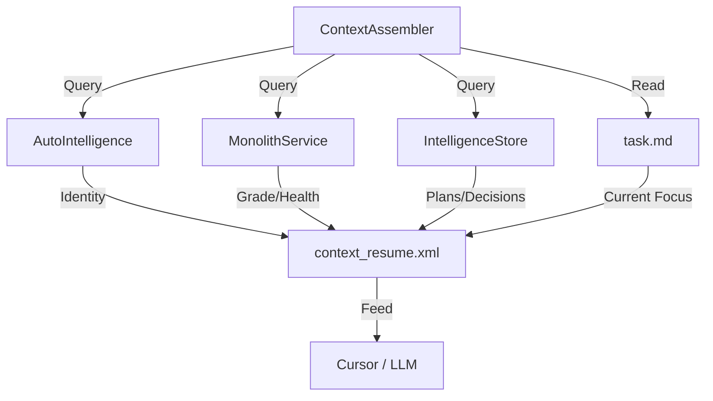

# Roadmap: The Context Resurrect Protocol (Phase X)

> **Objective**: Build the `side.cli remember` command.
> **Output**: `context_resume.xml` (The "Check-Point" Save File).

## 1. The Architecture: "The Memory Assembler"

We need a new service `ContextAssembler` that queries all our moats and serializes them into XML.



## 2. Data Mapping (The Ingredients)

| XML Section | Source Component | Method / Attribute |
| :--- | :--- | :--- |
| `<identity>` | `AutoIntelligence` | `get_or_create_profile()` -> `domain`, `languages` |
| `<health>` | `MonolithService` | `StrategicEvaluator.calculate_iq()` -> `grade`, `score` |
| `<active_issues>` | `IntelligenceStore` | `get_finding_stats()` -> `critical`, `high` |
| `<strategy>` | `IntelligenceStore` | `list_plans(status='active')` |
| `<current_focus>` | `FileSystem` | `read(task.md)` |

## 3. Implementation Steps

### Step 1: The Assembler (`context_assembler.py`)
Create a class that initializes all subsystems (readonly) and gathers data.
```python
class ContextAssembler:
    async def assemble(self) -> str:
        profile = await self.auto_intel.get_profile()
        stats = self.store.get_stats()
        # ... logic to build XML string ...
        return xml_string
```

### Step 2: The XML Template
Use Jinja2 or f-strings to maximize token efficiency.
*   **Constraint**: Keep total file under 4kb (approx 1000 tokens) to leave room for conversation.
*   **Format**: Minimal XML. `<tag>value</tag>`, no attributes unless necessary.

### Step 3: The Integration (`cli.py`)
Add `remember` command.
```python
@cli.command()
def remember():
    """Generate context_resume.xml for LLM injection."""
    xml = run_async(ContextAssembler().assemble())
    write_to_clipboard(xml) # Optional UX bonus
    print("✅ Context copied to clipboard! Paste into Cursor.")
```

## 4. OCP Integration (Vision 2030)
*   **Future**: The Assembler should also scan for `@Strategic` tags in the codebase using `grep` or `ForensicEngine` and append them to the `<strategy>` section.
*   **Benefit**: If you add `// @Strategic: Simplify DB` in code, it appears in your "Resume" automatically.

## 6. The Time Machine (Long-Term Memory)

To support "2-Year Planning", we must track the **Delta** of your strategy over time.

### 6.1 Database Strategy: Local-First, Cloud-Backup
*   **Local (`side.db`)**: Stores a snapshot of `context_resume.xml` every time you run `side remember`.
    *   Table: `snapshots (id, project_id, xml_content, created_at, grade_score)`
*   **Cloud (`Supabase`)**: Optional sync. If enabled, pushes encrypted snapshots to Supabase. This ensures your history survives a laptop switch.

### 6.2 The Delta Engine
We don't just show you today's status. We show you the **Velocity**.
*   **Day 1**: Grade 40/100 (No tests).
*   **Day 30**: Grade 92/100 (Full coverage).
*   **Insight**: "You improved Security by 200% in Q1. At this rate, you represent a highly mature Series A target."

### 6.3 Future Suggester
By analyzing the Delta, `Side` can predict bottlenecks.
*   *If finding velocity > fix velocity* -> "Suggestion: Pause features, focus on debt week."

