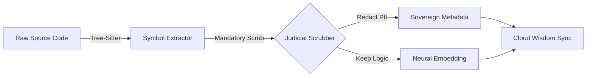

# Sidelith: Forensic Architecture & Neural Logic 🏛️

## 🏗️ 1. The Unified Data Fabric (OPL Model)
Sidelith adopts the Palantir-level **Object-Property-Link (OPL)** model. We move away from silos and into a unified, high-performance graph.

### The Forensic Ontology:
*   **Objects**: Symbols (CodeNodes), Intents (Why), Findings (Violations), Modules.
*   **Properties**: Line numbers, JSON payloads, risk scores, timestamps.
*   **Links**: `implemented_by`, `violates`, `clarifies`, `depends_on`.

---

## 🧠 2. The Neural Logic Graph (GNN Core)
We don't just "read" code; we index the **Semantic Soul** of the program.

| Layer | Component | Function |
| :--- | :--- | :--- |
| **AST** | Abstract Syntax Tree | Structural recognition (Classes/Functions). |
| **CFG** | Control Flow Graph | Execution path analysis (How it runs). |
| **DFG** | Data Flow Graph | Variable and state tracking (What it moves). |
| **GNN** | Graph Neural Network | Encoding the "Neural Logic" for drift detection. |
| **Cognitive** | Semantic Delta Inference | Detecting strategic shifts from cross-file changes. |

---

## 🛡️ 3. The Sovereign Judicial Scrubber
Privacy is our absolute moat. The **Scrubber** is a hard-coded local layer that ensures zero IP leakage to the cloud.

*   **Zero-Retention**: Sidelith never stores your actual source code—only the **Relational Logic**.
*   **Compliance**: SOC2/GDPR ready by design.

---

## 🚀 4. Technical Performance
*   **Local Backend**: High-concurrency SQLite with LSM-tree compression for 5+ year history.
*   **Async Processing**: Forensics run in worker pools to keep the IDE "twitchy."
*   **Neutral Middleware**: MCP-compatible binary that acts as the source of truth for all IDE agents.

---
© 2026 Sidelith | [Master Strategy](MASTER_STRATEGY.md) | [Walkthrough](WALKTHROUGH.md)
