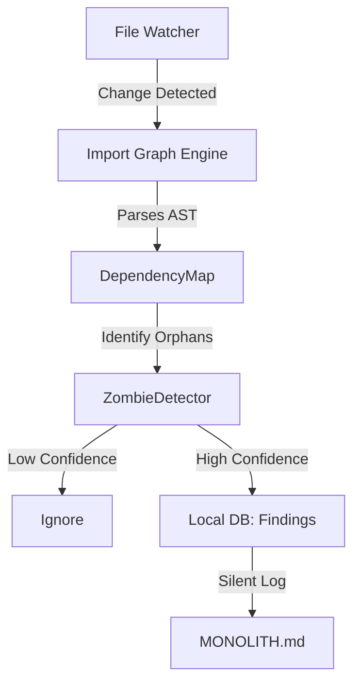

# Feature Design: The Passive Hygiene Monitor

> **Goal**: Give users X-Ray vision into their codebase's health (Broken Windows Theory) without manual auditing.

## 1. Can we automate this? (Feasibility)
**Yes, it is easy and safe.**
The audit I performed manually used a technique called **Static Import Analysis**. 
- **Method**: We scan every line of code for `import X` or `require('X')`.
- **Graph**: We build a directed graph: `File A -> imports -> File B`.
- **Zombie Detection**: Any file that has **zero incoming arrows** (and is not a known entry point like [main.py](../backend/src/side/intel/domain.py) or [page.tsx](../web/app/page.tsx)) is inherently a Zombie.

## 2. The "Trust" Problem
> "Will it create trust issues if we are wrong?"

**Yes, false positives destroy trust.**
If we tell a user "Delete [utils.py](../backend/src/side/tools/recursive_utils.py)" and it breaks their app (because it was dynamically imported via string `importlib`), they will uninstall Side.

### The Solution: "The Certainty Threshold"
We operate on a **"High Precision, Low Recall"** strategy.
- **We only flag if we are 99.9% sure.**
- If a file is *maybe* used, we say nothing.
- **Safe Zombies**: Directories that are completely disconnected from the dependency graph (like `src/side/intelligence`).

## 3. Architecture: The Background Listener
This fits perfectly into the "Silent Partner" (Daemon) model.

### How it works "Passively":
1.  **Idle Time**: When the user stops typing for 5 minutes.
2.  **Scan**: The `GraphBuilder` parses adjacent files.
3.  **Monolith Update**: A new section appears in [MONOLITH.md](../.side/MONOLITH.md):
    > 🧹 **Housekeeping**: `src/legacy/` appears to be dead code (0 references). 

## 4. Implementation Stages

### Phase 1: Python/JS Import Grapher
**Difficulty**: Low (Day 1).
- Use [ast](../backend/src/side/intel/auto_intelligence.py) module (Python) and `swc/babel` (JS) to extract imports.
- Store a simple adjacency list in `local.db`.

### Phase 2: The "Entry Point" Whitelist
**Difficulty**: Medium.
- We must know that [app/page.tsx](../web/app/page.tsx) is an entry point (Next.js) even if nothing imports it.
- We rely on [auto_intelligence.py](../backend/src/side/intel/auto_intelligence.py) to identify framework rules.

### Phase 3: The "Graveyard" UI
- Instead of "Delete Now", we offer **"Move to Graveyard"**.
- Code is moved to `_graveyard/` folder. If nothing breaks in 1 week, user can delete.

## Summary
This feature is a **Trust Builder**. By correctly identifying "Rot", you show the user you understand their code better than they do.

---
*Reference: [ORGANISM_ARCHITECTURE.md](./ORGANISM_ARCHITECTURE.md)*
