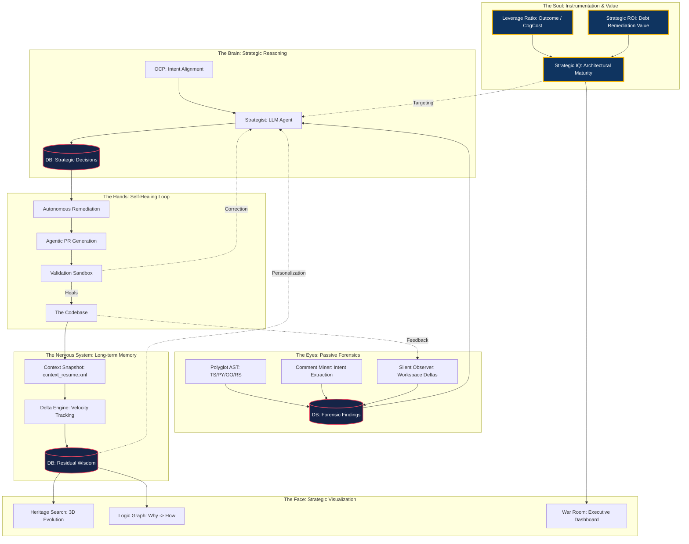

# The Sovereign Ledger: A Living Organism for Engineering Intent

This diagram represents the "Grand Unification" of Side Intelligence. It moves the project from a "Toolbox" of scripts to a "Self-Healing Logic Fabric" designed for the 2026 AI Engineering Crisis.

## 🏛️ The Living Organism Architecture

[Nervous System](./DESIGN_DATA_STRATEGY.md) | [Brain Logic](./DESIGN_BRAIN_LOGIC.md) | [Soul Metrics](./DESIGN_SOUL_METRICS.md) | [Orchestration SOP](./DESIGN_ORCHESTRATION_SOP.md)

---

## 🚀 The Nasdaq Flywheel: "Residual Wisdom"
1.  **Passive Sensing**: We capture the "Why" (Miner/Observer) while developers stay in flow.
2.  **Intent Alignment**: The Strategist ensures code doesn't drift from **Sovereign Objectives**.
3.  **Autonomous Healing**: The "Broken Windows" are fixed before they become debt (Self-Healing Hand).
4.  **Residual Memory**: Every session's context is preserved (Context Resurrect), building **Institutional Memory**.
5.  **Strategic IQ**: The value created is quantified as a **Strategic IQ**, providing the **System of Record** for the Nasdaq era.

---

## 🗑️ Strategic Outliers: The "Organism Rejection" List

These components do **NOT** belong in the living organism because they represent "Noise", "Ego", or "Amnesia":

1.  **Gamification (Streaks/Badges)**:
    *   *Reason*: We are a Professional Ledger, not a fitness app. "Days visited" is a vanity metric; "Leverage Ratio" is the truth.
    *   **Verdict**: DELETE.

2.  **BYOK (Bring Your Own Key)**:
    *   *Reason*: Fragments the "Closed Loop" audit trail and weakens the Sovereign Privacy moat. High-tier engineering requires a managed, secure, and instrumented pipe.
    *   **Verdict**: PHASE OUT.

3.  **Superficial Metrics (LoC / Commit Count)**:
    *   *Reason*: Measuring speed without intent leads to "Vibe Coding" debt.
    *   **Verdict**: REPLACE with **Strategic IQ** and **Remediation Velocity**.

4.  **Static Documentation**:
    *   *Reason*: Docs die. The organism requires **Living Intent** (OCP tags + Miner).
    *   **Verdict**: AUTOMATE via PR Rationalization.

5.  **Agentic Amnesia**:
    *   *Reason*: Every "New Chat" that doesn't know the project history is an organ failure.
    *   **Verdict**: MANDATORY use of `context_resume.xml`.

---
*Created by Antigravity | Reference: [MASTER_STRATEGY.md](./MASTER_STRATEGY.md)*
