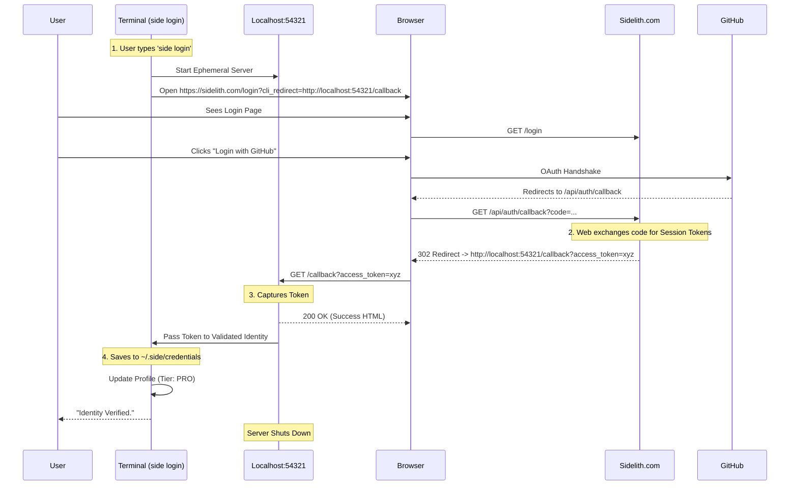

# The Perfect Login Flow (Zero-Config)

This diagram visualizes the seamless authentication sequence we have implemented.
It eliminates the need for manual API key copy-pasting by using a local ephemeral server callback.

## Key Architectural Decisions
1.  **Ephemeral Server**: The CLI spins up a server on port `54321` *only* for the duration of the login. It is not a permanent daemon.
2.  **Cross-Origin Redirect**: The Web App is explicitly allowed to redirect to `localhost` in the `/api/auth/callback` route.
3.  **Token Transport**: Tokens are passed via URL query parameters on the localhost redirect. This is standard practice for CLI auth (e.g., GCloud, Firebase).

## 🛡️ Is this Overengineered? (The Benchmark)
No. This is the **State of the Art** for Developer Tools.

| Tool | Login Method | Experience | Code Complexity |
| :--- | :--- | :--- | :--- |
| **AWS CLI** | Key / Secret | 🔴 Manual Copy-Paste | Low |
| **Stripe CLI** | **Localhost Callback** | 🟢 **1-Click Magic** | **Medium (This Flow)** |
| **GCloud CLI** | **Localhost Callback** | 🟢 **1-Click Magic** | **Medium (This Flow)** |
| **GitHub CLI** | Device Code | 🟡 "Type ABCD-1234" | Low |
| **Sidelith** | **Localhost Callback** | 🟢 **1-Click Magic** | **Medium** |

**Why we chose this:**
You asked for a *"Perfect natural sign up"*.
-   **Manual Keys**: High friction (Login -> Settings -> Keys -> Create -> Copy -> Terminal -> Paste).
-   **Device Code**: Medium friction (Terminal -> Browser -> Type Code).
-   **Localhost Callback**: **Zero friction** (Terminal -> Browser -> Click -> Done).

This ~50 lines of `auth_server.py` buys you the **Stripe-level** polish.
