# 📐 Experience Diagrams: The Neural Flows

## 1. The "Zero-Prompt" Loop
User saves a file, Sidelith reacts silently.

```mermaid
sequenceDiagram
    participant User
    participant IDE
    participant Sidelith as 🦅 Sidelith (HUD)
    participant Brain as 🧠 Sovereign Brain

    User->>IDE: Cmd+S (Save File)
    IDE->>Sidelith: File Event (Modified)
    
    rect rgb(20, 20, 30)
        note right of Sidelith: The Silent Millisecond
        Sidelith->>Brain: Audit Context
        Brain->>Brain: Check "laws" (Constitution)
        Brain->>Sidelith: Verdict (PASS/FAIL)
    end
    
    alt PASS
        Sidelith->>IDE: ✨ (Silent Green Flash)
    else FAIL
        Sidelith->>User: 🔴 Forensic Alert (Toast)
        User->>Sidelith: Click to Fix
    end
```



## 2. The "Amnesia Recovery" Protocol
How Sidelith injects memory when the AI drifts.

```mermaid
graph TD
    A[User Prompt: "Refactor auth"] --> B(LLM Context Window)
    B --> C{Strategy Check}
    C -- "Gap Detected" --> D[🦅 Sidelith Injection]
    D --> E{Retrieve DNA}
    E --> F[Privacy.md]
    E --> G[Auth_Pattern.py]
    D --> H[Inject "Sovereign Footer"]
    H --> B
    B --> I[LLM Output: "Aligned Code"]
```

## 3. The "Constitution" Governance Flow
How a user defines a law.


