# The Sovereign User Journey (Zero Friction)

This diagram visualizes the experience through the **User's Eyes**.
There are no API Keys, no config files, and no copy-pasting.

## The "Magical Loop"
From `side login` to **Full Sovereignty** in 3 clicks.

```mermaid
flowchart TD
    classDef terminal fill:#000,stroke:#333,stroke-width:2px,color:#fff;
    classDef browser fill:#fff,stroke:#333,stroke-width:2px,color:#000;
    classDef magic fill:#e1f5fe,stroke:#0277bd,stroke-width:2px,color:#000,stroke-dasharray: 5 5;

    subgraph Terminal ["🖥️ Terminal"]
        A[User types 'side login']:::terminal
        B[CLI Spins up Secure Server]:::terminal
    end

    subgraph Browser ["🌐 Browser"]
        C[AUTO-OPEN: sidelith.com/login]:::browser
        D[User clicks 'Continue with GitHub']:::browser
        E[GitHub OAuth Handshake]:::browser
    end

    subgraph Invisible ["✨ The Magic Loop"]
        F[Web Redirects to Localhost]:::magic
        G[CLI Catches Token]:::magic
        H[CLI Fetches 'Elite Tier' Profile]:::magic
    end

    subgraph Success ["✅ Success"]
        I[CLI: 'Identity Verified']:::terminal
        J[User: Ready to Code]:::terminal
    end

    A --> B
    B --> C
    C --> D
    D --> E
    E --> F
    F --> G
    G --> H
    H --> I
    I --> J
```

## The "Wow" Moments
1.  **Auto-Open**: The browser opens itself. The user doesn't hunt for a URL.
2.  **The Redirect**: The user never sees a token. It feels like the terminal and the browser are one application.
3.  **Tier Sync**: The user sees their *actual* billing status ("Elite Tier") instantly in the terminal. No manual refresh needed.

## Comparison to "Old Way"
-   **Old Way**: Login -> Settings -> API Keys -> Create Key -> Copy -> Switch App -> Paste. (7 Steps)
-   **Sovereign Way**: `side login` -> GitHub -> Approve. (3 Steps)

This is the **Apple-level polish** applied to a CLI tool.
